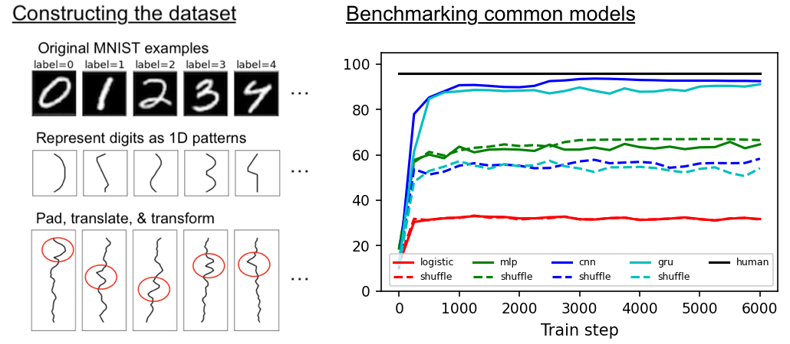
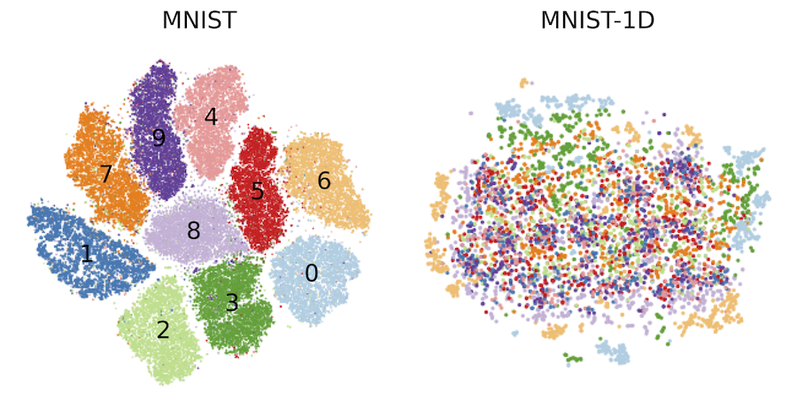
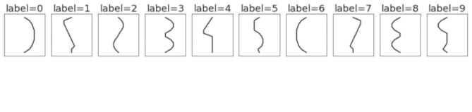
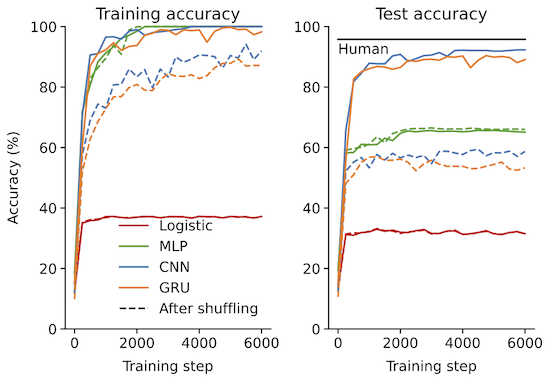
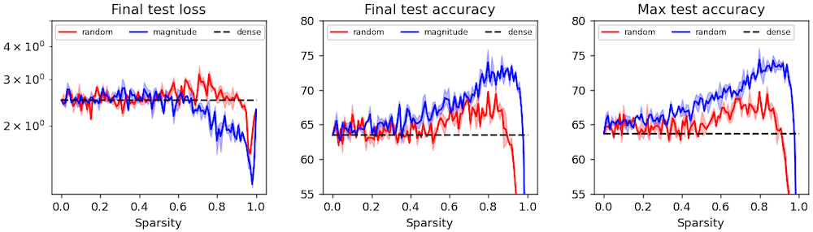
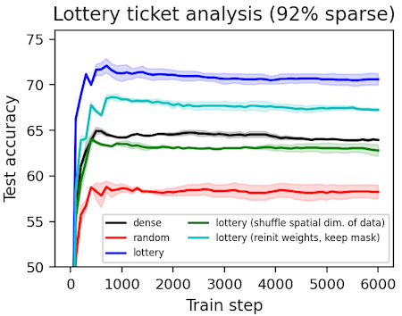
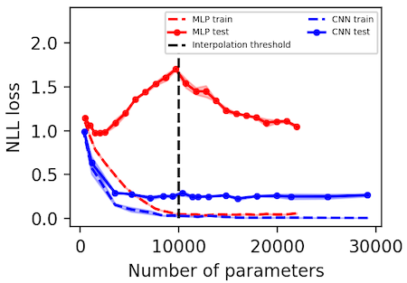
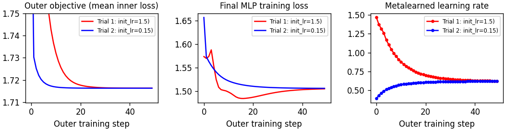
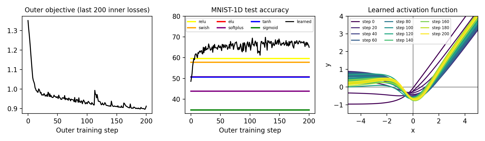
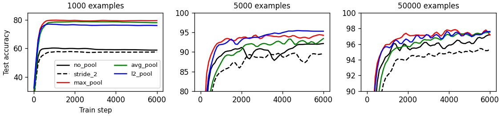

The MNIST-1D dataset
=======
### _**Dec 5, 2023**: MNIST-1D featured in Simon Prince's [Understanding Deep Learning](https://udlbook.github.io/udlbook/) textbook_

[Blog post](https://greydanus.github.io/2020/12/01/scaling-down/) | [Paper](https://arxiv.org/abs/2011.14439)


Run in your browser
--------
* Getting started
  * [Quickstart](https://bit.ly/3fghqVu)
  * [Building MNIST-1D](https://bit.ly/3ojC5v2)
* Example use cases
  * Quantifying CNN spatial priors (see [second half of quickstart](https://bit.ly/3fghqVu))
  * [Finding lottery tickets](https://bit.ly/3nCEIaL)
  * [Observing deep double descent](https://colab.research.google.com/drive/1pYHdmP0U6KYBzb3riqEk5PN3ULPRdtjL?usp=sharing)
  * [Metalearning a learning rate](https://bit.ly/38OSyTu)
  * [Metalearning an activation function](https://bit.ly/38V4GlQ)
  * [Benchmarking pooling methods](https://bit.ly/3lGmTqY)
* Community use cases
  * [TSNE: compare clustering of MNIST-1D vs. MNIST](https://colab.research.google.com/drive/1gUHCFoDd9pKbleyo3WOOPZtP3w5tH_fD?usp=sharing) (by [Dmitry Kobak](https://twitter.com/hippopedoid))
  * [A from-scratch, Numpy-only MLP with handwritten backprop](https://colab.research.google.com/drive/1E4w9chTkK-rPK-Zl-D0t4Q3FrdpQrHRQ?usp=sharing)
  * Send me a Colab link to your experiment and I'll feature it here.


Overview
--------

Machine learning models all get about the same test accuracy on MNIST. This dataset is smaller than MNIST and does a better job of separating good models from the bad.




| Dataset		| Logistic regression		| MLP 	| CNN 	| GRU* | Human expert |
| ------------- 			| :---------------: | :---------------: | :---------------: | :---------------: | :---------------: |
| MNIST 					    | 94% | 99+% | 99+% | 99+% | 99+% |
| MNIST-1D 					  | 32% | 68%  | 94%  | 91%  | 96%  |
| MNIST-1D (shuffle**)	| 32% | 68%  | 56%  | 57%  | ~30% |

*Training the GRU takes at least 10x the walltime of the CNN.

**The term "shuffle" refers to shuffling the spatial dimension of the dataset, as in [Zhang et al. (2017)](https://arxiv.org/abs/1611.03530).


Motivation
--------
The original MNIST dataset is supposed to be the [Drosophilia of machine learning](https://twitter.com/ivanukhov/status/639122460722528257) but it has a few drawbacks:
* **Discrimination between models.** The difference between major ML models comes down to a few percentage points.
* **Dimensionality.** Examples are 784-dimensional vectors so training ML models can take non-trivial compute and memory (think neural architecture search and metalearning).
* **Hard to hack.** MNIST is not procedurally generated so it's hard to change the noise distribution, the scale/rotation/translation/shear/etc of the digits, or the resolution.

 We developed MNIST-1D to address these issues. It is:
* **Discriminative between models.** There is a broad spread in test accuracy between key ML models.
* **Low dimensional.** Each MNIST-1D example is a 40-dimensional vector. This means faster training and less memory.
* **Easy to hack.** There's an API for adjusting max_translation, corr_noise_scale, shear_scale, final_seq_length and more. The code is clean and modular.
* **Still has some real-world relevance.** Though it's low-dimensional and synthetic, this task is arguably more interesting than [Sklearn's datasets](https://scikit-learn.org/stable/modules/classes.html#module-sklearn.datasets) such as two_moons, two_circles, or gaussian_blobs.


Getting the dataset
--------

Here's a minimal example of how to download the dataset:

```
import requests, pickle

url = 'https://github.com/greydanus/mnist1d/raw/master/mnist1d_data.pkl'
r = requests.get(url, allow_redirects=True)
open('./mnist1d_data.pkl', 'wb').write(r.content)

with open('./mnist1d_data.pkl', 'rb') as handle:
    data = pickle.load(handle)
    
data.keys()

>>> dict_keys(['x', 'x_test', 'y', 'y_test', 't', 'templates'])  # these are NumPy arrays
```

A slightly better way to do things is to clone this repo and then use the `get_dataset` method in `data.py` to do essentially the same thing.


Dimensionality reduction
--------

Visualizing the MNIST and MNIST-1D datasets with tSNE. The well-defined clusters in the MNIST plot indicate that the majority of the examples are separable via a kNN classifier in pixel space. The MNIST-1D plot, meanwhile, reveals a lack of well-defined clusters which suggests that learning a nonlinear representation of the data is much more important to achieve successful classification.



Thanks to [Dmitry Kobak](https://twitter.com/hippopedoid) for this contribution.


Constructing the dataset
--------

This is a synthetically-generated dataset which, by default, consists of 4000 training examples and 1000 testing examples (you can change this as you wish). Each example contains a template pattern that resembles a handwritten digit between 0 and 9. These patterns are analogous to the digits in the original [MNIST dataset](http://yann.lecun.com/exdb/mnist/).

**Original MNIST digits**


**1D template patterns**


**1D templates as lines**


In order to build the synthetic dataset, we pass the templates through a series of random transformations. This includes adding random amounts of padding, translation, correlated noise, iid noise, and scaling. We use these transformations because they are relevant for both 1D signals and 2D images. So even though our dataset is 1D, we can expect some of our findings to hold for 2D (image) data. For example, we can study the advantage of using a translation-invariant model (eg. a CNN) by making a dataset where signals occur at different locations in the sequence. We can do this by using large padding and translation coefficients. Here's an animation of how those transformations are applied.



Unlike the original MNIST dataset, which consisted of 2D arrays of pixels (each image had 28x28=784 dimensions), this dataset consists of 1D timeseries of length 40. This means each example is ~20x smaller, making the dataset much quicker and easier to iterate over. Another nice thing about this toy dataset is that it does a good job of separating different types of deep learning models, many of which get the same 98-99% test accuracy on MNIST.


Example Use Cases
--------

### Quantifying CNN spatial priors
For a fixed number of training examples, we show that a CNN achieves far better test generalization than a comparable MLP. This highlights the value of the inductive biases that we build into ML models. For code, see the [second half of the quickstart](https://colab.research.google.com/github/greydanus/mnist1d/blob/master/quickstart.ipynb).



### [Finding lottery tickets](https://bit.ly/3nCEIaL)
We obtain sparse "lottery ticket" masks as described by [Frankle & Carbin (2018)](https://arxiv.org/abs/1803.03635). Then we perform some ablation studies and analysis on them to determine exactly what makes these masks special (spoiler: they have spatial priors including local connectivity). One result, which contradicts the original paper, is that lottery ticket masks can be beneficial even under different initial weights. We suspect this effect is present but vanishingly small in the experiments performed by Frankle & Carbin.





### [Observing deep double descent](https://colab.research.google.com/drive/1pYHdmP0U6KYBzb3riqEk5PN3ULPRdtjL?usp=sharing)
We replicate the "deep double descent" phenomenon described by [Belkin et al. (2018)](https://arxiv.org/abs/1812.11118) and more recently studied at scale by [Nakkiran et al. (2019)](https://openai.com/blog/deep-double-descent/).



### [Metalearning a learning rate](https://bit.ly/38OSyTu)
A simple notebook that introduces gradient-based metalearning, also known as "unrolled optimization." In the spirit of [Maclaurin et al (2015)](http://proceedings.mlr.press/v37/maclaurin15.pdf) we use this technique to obtain the optimal learning rate for an MLP.



### [Metalearning an activation function](https://bit.ly/38V4GlQ)
This project uses the same principles as the learning rate example, but tackles a new problem that (to our knowledge) has not been tackled via gradient-based metalearning: how to obtain the perfect nonlinearity for a neural network. We start from an ELU activation function and parameterize the offset with an MLP. We use unrolled optimization to find the offset that leads to lowest training loss, across the last 200 steps, for an MLP classifier trained on MNIST-1D. Interestingly, the result somewhat resembles the Swish activation described by [Ramachandran et al. (2017)](https://arxiv.org/abs/1710.05941); the main difference is a positive regime between -4 and -1.



### [Benchmarking pooling methods](https://bit.ly/3lGmTqY)
We investigate the relationship between number of training samples and usefulness of pooling methods. We find that pooling is typically very useful in the low-data regime but this advantage diminishes as the amount of training data increases.




Dependencies
--------
 * NumPy
 * SciPy
 * PyTorch
